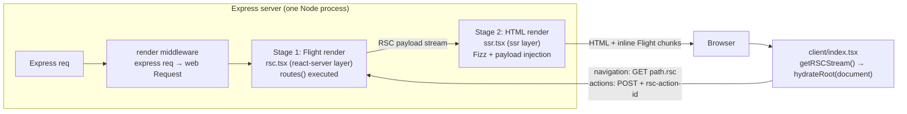
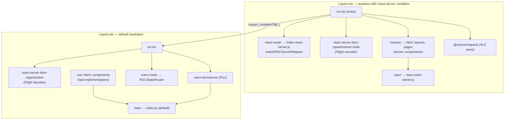
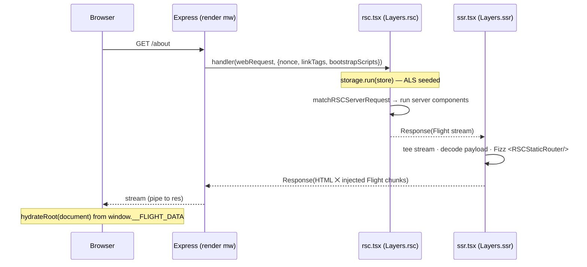
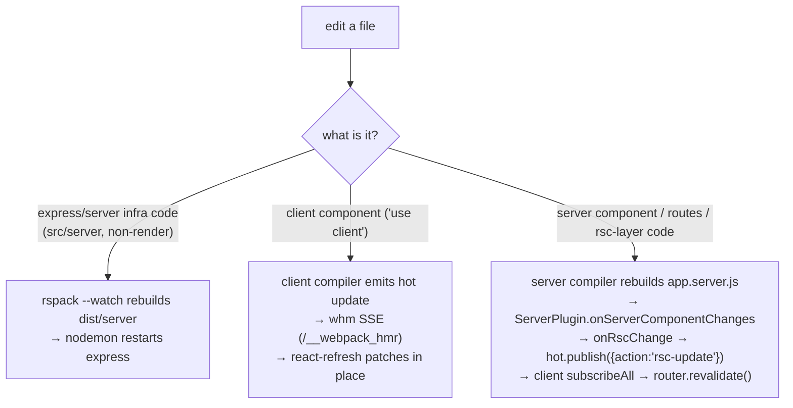

# React Server Components — Architecture

How this boilerplate implements RSC with **rspack v2** (native RSC support: layers + `experiments.rsc.createPlugins()`) and **react-router v8** (unstable RSC APIs), on top of the existing Express + streaming-SSR structure.

- [1. Big picture](#1-big-picture)
- [2. Build architecture](#2-build-architecture)
  - [2.1 Three compilers](#21-three-compilers)
  - [2.2 One server bundle, two layers, and the `react-server` condition](#22-one-server-bundle-two-layers-and-the-react-server-condition)
  - [2.3 Module rules](#23-module-rules)
  - [2.4 The RSC plugin pair (`rspack/plugins/rsc.plugin.ts`)](#24-the-rsc-plugin-pair-rspackpluginsrscplugints)
  - [2.5 Why we don't use rspack's built-in server-entry approach](#25-why-we-dont-use-rspacks-built-in-server-entry-approach)
- [3. Request lifecycle](#3-request-lifecycle)
  - [3.1 Express pipeline](#31-express-pipeline)
  - [3.2 The render middleware](#32-the-render-middleware)
  - [3.3 Stage 1 — Flight render (`rsc.tsx`)](#33-stage-1--flight-render-rsctsx)
  - [3.4 Stage 2 — HTML render (`ssr.tsx`)](#34-stage-2--html-render-ssrtsx)
- [4. Bundle assets](#4-bundle-assets)
- [5. Client entry (`src/client/index.tsx`)](#5-client-entry-srcclientindextsx)
- [6. react-router integration](#6-react-router-integration)
- [7. Request API — `request()`](#7-request-api--request)
- [8. Response API — `response()`](#8-response-api--response)
  - [8.1 Streams vs. headers](#81-streams-vs-headers)
  - [8.2 `headers`](#82-headers)
  - [8.3 `status`](#83-status)
  - [8.4 `cookies`](#84-cookies)
  - [8.5 `renderLock`](#85-renderlock)
  - [8.6 How it works](#86-how-it-works)
  - [8.7 Rules & caveats](#87-rules--caveats)
  - [8.8 Verified behaviour](#88-verified-behaviour)
- [9. Dev workflow & HMR](#9-dev-workflow--hmr)
- [10. Production build](#10-production-build)
- [11. Gotchas](#11-gotchas)
- [12. Redirects](#12-redirects)

---

## 1. Big picture

Every document request flows through a **two-stage pipeline on the server**. It's not the same render done twice — each stage is a different React runtime doing a different half of the job, and both runtimes live in the *same* bundle:

1. **Flight render (RSC)** — server components execute (this is the only place they ever run) and produce an *RSC payload*: a serialized stream of the rendered element tree, with `'use client'` components replaced by module references.
2. **HTML render (SSR / Fizz)** — the payload from stage 1 is decoded back into React elements and `react-dom/server` streams HTML out of it. Server components are inert data at this point; the only components that *execute* here are client components. The raw Flight stream is interleaved into the HTML as inline `<script>` chunks so the browser can hydrate from it without a second network round trip.



> **Two stages ≠ your code runs twice.** Server components execute **only in stage 1** — stage 2 decodes the payload, where they are already reduced to plain serialized elements (`<div>`, text, client references); there is no component function left to call. Client components are the opposite: they don't execute in stage 1 (they're serialized as manifest references) but *do* execute in stage 2, and again in the browser on hydration. So a `console.log` fires, per request:
>
> | Where the log is | Server console | Browser console |
> |---|---|---|
> | Server component | 1× (Flight pass only) | never |
> | Client component | 1× (Fizz/SSR pass) | 1× on hydration (2× in dev — `StrictMode` double-invocation) |
>
> Two things that make a server-component log appear more often, neither of which is double-rendering: every client navigation (`GET /path.rsc`, [§6](#6-react-router-integration)) runs the Flight pass again, and after a server action `matchRSCServerRequest` re-renders the route tree for the `rerender` payload — so one POST logs the action *and* the affected server components.

Design decisions that shape everything below:

| Decision | Consequence |
|---|---|
| Keep the pre-RSC file structure (no dedicated `rsc.entry.ts` / `server.entry.ts` from the rspack guide) | One server bundle (`app.server.js`) exporting a `handler(Request) → Response`; the RSC/SSR split happens via **layers inside** that bundle, not via separate entries |
| Asset injection is done manually from client-compiler stats ([§4](#4-bundle-assets)) | We control `bootstrapScripts`, CSS `<link>` tags, nonces — the plugin's built-in asset conventions are not used |
| Per-request data flows through a single `AsyncLocalStorage` ([§7](#7-request-api--request)) | Server components call `request()` instead of receiving loader data through router context |
| The whole document (`<html>…`) is a server component (`Html`) | There is no HTML template; CSS links, favicons, the manifest, env bootstrap — all rendered by React |

---

## 2. Build architecture

### 2.1 Three compilers

[rspack.config.ts](../rspack.config.ts) exports a multi-compiler array: `[express, client, server]`.

| Config | Entry | Target | Output | RSC transform | Externals |
|---|---|---|---|---|---|
| [express.config.ts](../rspack/configs/express.config.ts) | `src/server/index.ts` | `node` | `dist/server/index.js` (cjs) | **no** (`rules.typescript`) | `webpack-node-externals` **+ `/app.server.js/`** |
| [client.config.ts](../rspack/configs/client.config.ts) | `src/client/index.tsx` | `browserslist` | `dist/client/js/[name].[fullhash].js` | yes | — |
| [server.config.ts](../rspack/configs/server.config.ts) | `src/server/middleware/render/rsc.tsx` | `node` | `dist/client/js/app.server.js` (cjs) | yes | **none — everything is bundled** |

Why three, and why split this way:

- **`express`** is the plain HTTP server: middleware, routing, logging. It knows nothing about React. It is *not* part of the RSC compiler pair, so it can be built and watched independently — which is what makes the dev loop work ([§9](#9-dev-workflow--hmr)). The `/app.server.js/` external keeps `require('../client/js/app.server.js')` as a literal runtime `require` instead of bundling the render bundle into the express bundle.
- **`client`** is the browser bundle. It carries the HMR/react-refresh plumbing in dev and the `ClientPlugin` half of the RSC plugin pair.
- **`server`** is the *render* bundle. Its entry is the RSC handler itself. Two non-obvious choices:
  - `output.path` is `dist/client` — it's emitted **next to the client assets**, so in prod the express bundle finds it at `../client/js/app.server.js` relative to `dist/server`, and in dev it lives in the same in-memory filesystem `@rspack/dev-middleware` already manages.
  - **No `webpack-node-externals`.** `react`, `react-dom`, `react-router` and `react-server-dom-rspack` *must* be bundled, because the two layers inside this bundle need to resolve *different builds of the same packages* (see next section). If they were externalized, Node's runtime resolution would pick one build for both layers and the whole scheme collapses.

> ⚠️ The `client` and `server` configs are **coupled** by the RSC plugin pair and must always run in the same multi-compiler build. `rspack --configName=client` alone deadlocks — the ClientPlugin waits for information from the ServerPlugin that never arrives.

### 2.2 One server bundle, two layers, and the `react-server` condition

React ships two builds of itself, selected by the `react-server` [export condition](https://nodejs.org/api/packages.html#conditional-exports) in its `package.json`:

- **default build** — the one you know: `useState`, `useEffect`, the client internals dispatcher.
- **`react-server` build** (`react.react-server.js`) — the subset legal inside server components: no state/effect hooks, plus the Flight-renderer internals. `react-server-dom-rspack/server.node` (the Flight *encoder*) only works against this build.

The SSR pass, however, needs the **default** build — `react-dom/server` (Fizz) and `react-server-dom-rspack/client` (the Flight *decoder*) are "client" code that happens to run in Node. So one bundle must contain **both builds of React simultaneously**. That's exactly what rspack layers do: a layer is a named partition of the module graph, and `resolve.conditionNames` can be set *per layer*, so the same import specifier resolves to different files depending on which layer the importing module is in.

The layer names come from `experiments.rsc.Layers`:

```ts
Layers.rsc === 'react-server-components'
Layers.ssr === 'server-side-rendering'
```

The three layer rules in [server.config.ts](../rspack/configs/server.config.ts:32) do all the work — order and `exclude` matter:

```ts
// 1. ssr.tsx is pinned to the SSR layer
{ resource: ssrModule, layer: plugins.Layers.ssr },

// 2. the entry (rsc.tsx) is pinned to the RSC layer, resolved with react-server
{
    resource: rscEntry,
    layer: plugins.Layers.rsc,
    resolve: { conditionNames: ['react-server', '...'] }
},

// 3. everything *imported from* the RSC layer inherits the react-server
//    condition — except ssr.tsx, which escapes into its own layer (rule 1)
{
    issuerLayer: plugins.Layers.rsc,
    exclude: ssrModule,
    resolve: { conditionNames: ['react-server', '...'] }
}
```

Mechanics: a module inherits the layer of its issuer unless a rule assigns it one. Rule 2 puts the entry into `Layers.rsc`; every module it (transitively) imports inherits that layer, and rule 3 makes all of those resolve `react` → `react.react-server.js`, `react-router` → `index-react-server.js`, etc. (`'...'` appends the default conditions after `react-server`). The single exception is `ssr.tsx`: rule 1 re-assigns it to `Layers.ssr`, rule 3's `exclude` keeps the react-server condition off its resolution, and from there its entire import subtree (react-dom/server, the Flight decoder, `RSCStaticRouter`) resolves normally.



One more effect of the layer split: a `'use client'` module reached from the RSC layer is **not compiled into that layer** — the swc RSC transform replaces its body with `registerClientReference(...)` stubs. The real implementation is instantiated in the SSR layer (for server-side rendering of client components) and in the browser bundle (for hydration). So "one component, up to three module instances" is normal here.

The **client compiler** has no layer rules — the browser is one world — but its modules still go through the RSC transform so that `'use client'` / `'use server'` directives are processed (client components get registered for the manifest; `'use server'` files become `createServerReference` proxies that call the server).

### 2.3 Module rules

All shared rules live in [rspack/rules/common.ts](../rspack/rules/common.ts). The RSC-relevant ones:

#### `typescriptRSC` — app code (client + server configs)

```ts
export const typescriptRSC = {
    test: /\.[jt]sx?$/,
    exclude: [/node_modules/],
    oneOf: [
        { issuerLayer: Layers.rsc, use: swc(true, false) },  // RSC transform ON, React Compiler OFF
        { use: swc(true, true) }                             // RSC transform ON, React Compiler ON
    ]
}
```

`swc(reactServerComponents, reactCompiler)` builds a `builtin:swc-loader` config; `rspackExperiments.reactServerComponents: true` is the directive-parsing transform that makes `'use client'` / `'use server'` work.

The `oneOf` split exists because of a **React Compiler × react-server crash**: compiled components import `react/compiler-runtime`, whose `useMemoCache` reads `__CLIENT_INTERNALS_DO_NOT_USE_OR_WARN_USERS_THEY_CANNOT_UPGRADE` from `react`. Under the `react-server` condition, `react.react-server.js` only exports the `__SERVER_INTERNALS…` variant — so any *compiled server component* crashes the Flight render with `Cannot read properties of undefined (reading 'H')` (in prod this gets redacted into an empty-digest RSC error plus a react-router "Could not find a matching route for errors"). Hence: **compiler off in the `Layers.rsc` branch**, on everywhere else. Nothing of value is lost — server components render once per request, so memoization buys nothing; client components still get compiled in both the SSR layer and the browser bundle (Fizz and DOM dispatchers implement `useMemoCache`).

Edge case: the entry `rsc.tsx` itself has *no issuer*, so it falls into the compiler-ON branch. Harmless as long as it exports no components (it exports a plain `handler` function).

#### `vendorRSC` — react-router dist files (client + server configs)

react-router marks its own client boundary with a literal `'use client'` directive **inside its shipped dist files**. Directives are only honored by RSC-aware loaders, and loaders don't run over `node_modules` by default — so this rule runs the swc RSC transform (parser only, no TS) over `node_modules/react-router`:

```ts
export const vendorRSC = {
    test: /\.m?js$/,
    include: [/node_modules[\\/]react-router[\\/]/],
    exclude: [rscBoundary],   // handled by vendorReactRouter below
    use: { loader: 'builtin:swc-loader', options: { ..., rspackExperiments: { reactServerComponents: true } } }
}
```

Remove this and the server build fails with `useEffect not found in react`: without the transform, react-router's client-only modules are compiled *into* the RSC layer as ordinary modules and try to pull client hooks out of `react.react-server.js`.

#### `vendorReactRouter` — the boundary file only (client + server configs)

`rscBoundary` matches exactly one file: `node_modules/react-router/dist/*/index-react-server-client.js` — a **re-export-only** `'use client'` barrel (`Outlet`, `UNSAFE_WithComponentProps`, …). Its exports are never statically imported on the client; they're resolved **at runtime through the RSC client manifest**. rspack's ClientPlugin (≤ 2.1.3) doesn't mark manifest-referenced exports as used for such re-export-only vendor boundaries ([rspack#14756](https://github.com/web-infra-dev/rspack/issues/14756)), so production `usedExports` tree-shakes them away → minified **React error #306** on hydration (prod only; dev doesn't run `usedExports`).

The fix compiles *just this file* to CommonJS:

```ts
export const vendorReactRouter = {
    test: rscBoundary,
    type: 'javascript/auto',   // package is "type": "module" — without this: "exports is not defined"
    use: { loader: 'builtin:swc-loader', options: {
        jsc: { parser: { syntax: 'ecmascript' } },
        module: { type: 'commonjs' },                       // CJS exports are dynamic → per-export tree-shaking disabled
        rspackExperiments: { reactServerComponents: true }  // still emit registerClientReference on the server
    } }
}
```

This is the same mechanism that made react-router 7's CJS dist immune. Converting *all* of react-router to CJS also works but costs ~40% on `main.js` (503 KB vs 364 KB) and rewrites its dynamic `import()`s into sync `require()`s — rejected. `vendorRSC` and `vendorReactRouter` must not overlap (hence the `exclude`), or two loaders run over the same module.

#### `typescript` — express config only

Plain swc, RSC transform **off**, compiler on. The express bundle contains no React and must not accidentally process directives.

### 2.4 The RSC plugin pair ([`rspack/plugins/rsc.plugin.ts`](../rspack/plugins/rsc.plugin.ts))

```ts
const { ServerPlugin, ClientPlugin } = experiments.rsc.createPlugins()

export const rscClientPlugin = new ClientPlugin()          // → client.config plugins
export const rscServerPlugin = new ServerPlugin({          // → server.config plugins
    onServerComponentChanges() { for (const l of listeners) l() }
})
```

`createPlugins()` returns a **coupled pair sharing internal state** — this is why both instances must come from one call and run in one multi-compiler build. Division of labor:

- **ServerPlugin** (server compiler): drives the directive handling in the server graph — `'use client'` modules become `registerClientReference` stubs (per layer, see §2.2), `'use server'` modules get `registerServerReference` so `loadServerAction` can find them by id. It collects the full set of *client references* the server graph produced and hands it to the ClientPlugin.
- **ClientPlugin** (client compiler): makes sure every referenced client module actually exists in the browser bundle (they're not reachable from `src/client/index.tsx` by static imports — the router payload references them by manifest id), and generates the module maps `react-server-dom-rspack` uses at runtime to turn reference ids into chunk loads + module exports on both sides.

The manifest plumbing is entirely internal — `react-server-dom-rspack` picks it up through rspack runtime globals; no manifest file is read in app code.

The one custom bit is the **HMR bridge**: `onServerComponentChanges` fires on server-compiler rebuilds that touched server components; `onRscChange(listener)` is a plain module-level pub/sub the dev middleware subscribes to ([§9](#9-dev-workflow--hmr)). This works because in dev the rspack config module and the express server run in the **same Node process**, so both sides see the same module instance.

### 2.5 Why we don't use rspack's built-in server-entry approach

The [official rspack RSC guide](https://v2.rspack.rs/guide/tech/rsc#server-entry) structures apps around dedicated generated entries (an RSC entry and an SSR/server entry) and a `'use server-entry'` directive: the plugin attaches `entryJsFiles` (the client compiler's entry output) and `entryCssFiles` (CSS collected from that server component's descendant tree) as static properties on the marked component, and the server reads assets off the import. This repo deliberately keeps its historical structure instead:

- **One server bundle, one export.** `server.config`'s entry is our own `rsc.tsx`, built with `library: { type: 'commonjs2' }`, exporting `handler(request, options) → Promise<Response>`. The SSR half is not a second entry — it's `ssr.tsx` pulled into the same bundle in a different layer. The express app treats the whole render pipeline as a single opaque module it `require`s ([§4](#4-bundle-assets)).
- **Manual asset injection.** Instead of the plugin deciding which scripts/styles reach the HTML, the express side reads the *client compiler's stats*, extracts the `main` entrypoint's assets with `ChunkExtractor`, and passes them into the render as `bootstrapScripts` / `linkTags` ([§4](#4-bundle-assets)). This keeps full control over nonces, preload tags and the env bootstrap script — the same mechanism the boilerplate used before RSC.

What we still rely on from the plugins: the directive transforms, the layer-aware client-reference machinery and the runtime module maps (§2.4). What we skip: the entry-file conventions and automatic asset injection.

---

## 3. Request lifecycle

### 3.1 Express pipeline

[src/server/index.ts](../src/server/index.ts):

```ts
express()
    .use(cookieParser)   // universal-cookie-express
    .use(favicon())
    .use(hmr())          // dev: [dev-middleware, hot-middleware, render] · prod: [render]
    .use(logger)         // morgan
    .use(nonce)          // req.nonce = uuid v4 (per request, for CSP)
    .use(router)         // health/version/pwa/static + appRoutes
    .use(error)
```

`appRoutes` is a catch-all — `router.all(/.*/, render)` — whose controller just calls `res.renderApp().catch(next)`. `renderApp` is installed by the render middleware, which the `hmr()` wrapper places *after* the webpack middlewares in dev so that `res.locals.webpack` is populated.

### 3.2 The render middleware

[src/server/middleware/render/index.tsx](../src/server/middleware/render/index.tsx) defines `res.renderApp`:

1. **Express → Web `Request`** (`toWebRequest`): URL rebuilt from `req.protocol` + `Host` header + `req.originalUrl`; all headers copied (array values appended); for non-GET/HEAD the express stream becomes the body via `Readable.toWeb(req)` with `duplex: 'half'` (required by undici for streaming request bodies — this is what lets server-function POSTs stream through untouched).
2. **Assets**: a `ChunkExtractor` is built from the client compiler's stats (`getStats(res)`, [§4](#4-bundle-assets)).
3. **Handler resolution** (`getRender(res)`, [§4](#4-bundle-assets)): prod — `require('../client/js/app.server.js')`; dev — the freshest bundle read out of dev-middleware's in-memory fs and evaluated with `require-from-string`.
4. **Invoke** the bundle's `handler(webRequest, options)` with:
   - `nonce` — from the nonce middleware,
   - `linkTags` — CSS preload+stylesheet descriptors (rendered later *by a server component*, [§7](#7-request-api--request)),
   - `bootstrapScriptContent` — `setEnvVars()`: an inline `window.env_vars=Object.freeze({...})` snippet exposing `CLIENT_*` env to the browser,
   - `bootstrapScripts` — the client entry's JS asset URLs.
5. **Web `Response` → Express**: status + headers copied, `Readable.fromWeb(response.body).pipe(res)` — the whole thing stays a stream end-to-end.

### 3.3 Stage 1 — Flight render ([`rsc.tsx`](../src/server/middleware/render/rsc.tsx))

This module *is* the server bundle's entry and lives in the `react-server` layer. Its exported `handler` does two things: seed the per-request store and run react-router's RSC matcher.

```ts
export const handler = async (request: Request, options: RenderOptions): Promise<Response> =>
    renderHTML(                       // stage 2, SSR layer
        request,
        await storage.run(            // AsyncLocalStorage — §7
            {
                nonce: options.nonce,
                linkTags: options.linkTags,
                url: new URL(request.url),
                headers: request.headers,
                cookies: new Cookies(request.headers.get('cookie'))
            },
            () => fetchServer(request) // stage 1
        ),
        options
    )
```

`fetchServer` is `unstable_matchRSCServerRequest` with:

| Option | Source | Role |
|---|---|---|
| `routes: routes()` | [`@/shared/app`](../src/client/components/@shared/app/index.tsx) | the `RSCRouteConfig` route tree ([§6](#6-react-router-integration)) |
| `basename` | `@/common` (pathname of `CLIENT_HOST`) | strip/prepend the app's base path |
| `decodeReply` / `decodeAction` / `decodeFormState` / `loadServerAction` | `react-server-dom-rspack/server.node` | decode server-function calls & form actions and resolve action ids to modules via the server manifest |
| `createTemporaryReferenceSet` | same | round-trip client-only values through action calls |
| `generateResponse` | `(match, options) => new Response(renderToReadableStream(match.payload, options), { status: match.statusCode, headers: match.headers })` | encode the matched payload as a Flight stream |

`matchRSCServerRequest` handles *every* kind of request against the route tree: document requests, `.rsc` payload requests for client navigations, `.manifest` requests for lazy route discovery, and server-function/form-action POSTs (it decodes and *executes* the action, then re-renders). In all cases the result is a `Response` whose body is the **Flight stream**: server components have executed; client components appear as manifest references; the payload also carries router state (matches, errors, redirects, `formState`).

Note what `renderToReadableStream` here is: the **Flight encoder** from `react-server-dom-rspack/server.node` — resolvable only under the `react-server` condition, i.e. only inside this layer.

### 3.4 Stage 2 — HTML render ([`ssr.tsx`](../src/server/middleware/render/ssr.tsx))

`ssr.tsx` is imported by `rsc.tsx` but escapes into the SSR layer (§2.2), so *its* `renderToReadableStream` is Fizz from `react-dom/server`, and `createFromReadableStream` is the Flight **decoder** from `react-server-dom-rspack/client`.

```ts
export const renderHTML = (request, serverResponse, options) =>
    routeRSCServerRequest({
        request,
        serverResponse,               // the Flight Response from stage 1
        createFromReadableStream,
        async renderHTML(getPayload) {
            const payload = await getPayload()
            const formState = payload.type === 'render' ? await payload.formState : undefined
            return renderToReadableStream(<RSCStaticRouter getPayload={getPayload} />, {
                formState,
                nonce: options.nonce,
                signal: request.signal,
                bootstrapScripts: options.bootstrapScripts,
                bootstrapScriptContent: options.bootstrapScriptContent
            })
        }
    })
```

What `unstable_routeRSCServerRequest` does (verified against react-router 8 source):

1. **Pass-through short-circuit.** If the URL ends in `.rsc` (client navigation) or `.manifest` (route discovery), or the request has an `rsc-action-id` header (server-function call), or the stage-1 response is marked `React-Router-Resource: true` — the Flight response is returned **as-is**. No HTML is rendered for those.
2. **Redirect detection.** The Flight stream is cloned and pre-decoded; a `202` + `{type:'redirect'}` payload becomes a real 3xx `Response` with a `Location` header before any HTML work happens.
3. **HTML render.** Otherwise the stream is teed: one copy feeds `createFromReadableStream` → the decoded payload renders through `RSCStaticRouter` under Fizz (this is where client components actually execute on the server — in the SSR layer, with the default React build). `formState` enables progressive form-action enhancement (no-JS `useActionState` submits). `bootstrapScripts` / `nonce` are plain Fizz options.
4. **Payload injection.** The *other* copy of the Flight stream is piped through `injectRSCPayload(...)`: as HTML streams out, Flight chunks are interleaved as inline `<script>`s that push into `window.__FLIGHT_DATA`. Late-arriving Flight rows (e.g. `Suspense` content resolving mid-stream) appear in the HTML exactly when ready.
5. **Redirects thrown during the render** (from a server component, which surface as a Flight error carrying a `REACT_ROUTER_ERROR:REDIRECT:…` digest) are recovered from Fizz's `onError`: a real 3xx if the shell hasn't flushed yet, otherwise a trailing `<meta http-equiv="refresh">` since the headers are already gone. This only works because `ssr.tsx` forwards the `onError`/`onHeaders` callbacks `routeRSCServerRequest` passes into `renderHTML` — see [§12](#12-redirects).



---

## 4. Bundle assets

We do **not** use the rspack RSC guide's server-entry asset convention. The server needs two things it can't know by itself — *which JS files bootstrap the client* and *which CSS files the client entry emitted* — and both come from the **client compiler's stats**. The pipeline, step by step:

**1. Build time (client compiler only).** In prod, [`stats.plugin.ts`](../rspack/plugins/stats.plugin.ts) hooks `processAssets` at the REPORT stage and emits a trimmed `dist/client/stats.json` with exactly the fields the extractor needs — `assets`, `chunkGroups`, `chunkGroupChildren`, chunk→files, hash/ids, `publicPath`, `outputPath`. This is the client compiler's *own* view of what it emitted, so hashed filenames are always in sync with the build.

**2. Request time — obtaining stats** ([`render.util.ts`](../src/server/middleware/render/render.util.ts) `getStats`). Two paths, same shape out:
   - **Prod** — read `dist/client/stats.json` from disk. (`getRender` alongside it is a plain `require('../client/js/app.server.js')`, cached by Node's module cache — the bundle is evaluated once per process.)
   - **Dev** — `@rspack/dev-middleware` runs with `serverSideRender: true`, exposing the latest `MultiStats` on `res.locals.webpack.devMiddleware.stats`; `getStats` calls `toJson(statsOptions)` and picks the child named `client`. (`getRender` picks the child named `server`, finds `js/app.server.js` in `assetsByChunkName.main`, reads it from dev-middleware's **in-memory output filesystem** and evaluates it with `require-from-string` — on every request, so a rebuilt server bundle is picked up with zero express restarts.)

   Because both paths produce the same stats shape, dev and prod behave identically downstream.

   > ⚠️ `statsOptions` is explicit (`all: false` + named fields) because in rspack v2 `stats.toJson({})` **omits chunk groups** — with defaults the extractor finds no entrypoints and throws.

**3. Asset extraction** ([`ChunkExtractor`](../src/server/middleware/render/chunk-extractor/chunk-extractor.ts) — a minimal, local re-implementation of the loadable-style extractor). For each entrypoint (default `['main']`) it resolves `namedChunkGroups['main'].assets`. A chunk group's asset list is the **complete, ordered closure** of files needed to boot that entrypoint — anything `splitChunks` breaks out is still listed — so no chunk-graph walking is needed. It then filters to `.js`/`.css`, drops `.hot-update.js` artifacts (dev), dedupes by URL, and joins each filename with `CLIENT_PUBLIC_PATH`.

**4. Injection into HTML** ([render middleware](../src/server/middleware/render/index.tsx)). The extracted assets split into two roles:
   - **JS** → `bootstrapScripts`: every `.js` asset of the `main` entrypoint, passed to Fizz's `renderToReadableStream`, which emits them as `<script async>` at the right streaming moment and coordinates hydration. (`bootstrapScriptContent` — `setEnvVars()`, the inline env bootstrap — rides along.)
   - **CSS** → `linkTags`: for every `.css` asset, a `rel="preload" as="style"` + `rel="stylesheet"` pair (nonce'd). These **cannot** be injected by the express layer, because there is no HTML template — the document is React. So they travel through the ALS store ([§7](#7-request-api--request)) and the [`Html`](../src/client/components/@shared/html/index.tsx) *server component* renders them in `<head>` during the Flight render — they land in the first flushed HTML bytes.

**5. The part the extractor does *not* do.** Everything module-level — which chunk holds which `'use client'` component, loading those chunks in the browser, matching them up during hydration — is handled by the RSC client/server manifests the plugin pair wires together (§2.4); no manifest file is touched in app code. Likewise, lazy-route chunks need no handling here: route-level `import()`s in `routes()` are server-side code-splitting, and client-component chunks referenced by the payload are loaded by `react-server-dom-rspack`'s runtime module map on demand. Bundle-asset extraction in this architecture has exactly two jobs — entry JS for bootstrap, CSS links for the shell — and the extractor covers both.

**CSS coverage invariant.** The extractor only sees the `main` chunk group — CSS in an *async* chunk group would be invisible to it (SSR'd HTML arrives before that chunk's CSS → FOUC). Today this cannot happen (verified against `dist/client/stats.json`, July 2026): even though routes are lazy and `@/pages/home` imports its own `.scss`, the ClientPlugin injects client-reference modules such that **all CSS merges into `css/main.*.css`** — the async chunks (`js/237.*` etc.) are JS-only, and `main` is the only named chunk group. If that ever changes (explicit CSS `splitChunks` cache groups, per-route CSS splitting in a future rspack), the fix is *not* extending the extractor but calling `preinit(cssUrl, { as: 'style', precedence, nonce })` from the component that owns the chunk — the hint rides the Flight stream, Fizz emits the link during SSR, and React dedupes it on client navigation. Cheap tripwire: assert that no chunk group besides the entrypoints contains `.css` assets.

**Why no `preload()`/`preinit()` today.** react-dom's resource-hint APIs exist for components that *can't reach* `<head>` and discover resources mid-render. Neither applies here: the asset list is fully known before rendering starts, and `Html` renders the literal `<head>`, so the stylesheet links are in the first flushed HTML bytes — there is no earlier moment a hint could move them to. Likewise `bootstrapScripts` is the purpose-built Fizz API for the hydration entry; `preinit(src, {as: 'script'})` would be an equivalent-or-worse substitute. Rendering the tags yourself is the baseline the hint APIs emulate. One caveat if the approaches ever mix: `preinit`'ed stylesheets live in React's `precedence` system and manual links (no `precedence` prop) don't — React dedupes only *within* that system, so the same href via both mechanisms loads **twice**. Pick one mechanism per stylesheet.

Two known cosmetic warts (harmless today): `getLinkTags()`'s `reduceRight` reverses stylesheet order relative to the chunk group's dependency order (irrelevant with a single CSS file; switch to `reduce` before splitting CSS), and the `rel="preload"` half of each pair adds nothing while the stylesheet link itself sits in the initial `<head>` (the preload scanner discovers both at the same instant). Also note prod re-reads and re-parses `stats.json` on every request via the `ChunkExtractor` constructor — the file never changes after boot, so this could be hoisted, but it's negligible at present scale.

---

## 5. Client entry ([`src/client/index.tsx`](../src/client/index.tsx))

Four steps, in order:

```ts
__webpack_public_path__ = getENV('CLIENT_PUBLIC_PATH')
```
Runtime public path for chunk loading — must run before any async chunk is requested; reads from `window.env_vars` (populated by `bootstrapScriptContent`, which Fizz guarantees executes before the module scripts).

```ts
setServerCallback(createCallServer({ createFromReadableStream, createTemporaryReferenceSet, encodeReply }))
```
Global server-function transport. When any code calls an imported `'use server'` function, `react-server-dom-rspack`'s client runtime invokes this callback; `createCallServer` (react-router) sends `POST location.href` with headers `Accept: text/x-component` + `rsc-action-id: <id>` and an `encodeReply(args)` body, decodes the Flight response, and — inside `startTransition` — applies the returned payload: `redirect` payloads navigate, `action` payloads resolve the caller's return value and apply the `rerender` (updated route tree) if no newer action has landed (out-of-order protection via `__routerActionID`).

```ts
createFromReadableStream<RSCPayload>(getRSCStream()).then(payload => {
    startTransition(() => {
        hydrateRoot(document,
            <StrictMode><RSCHydratedRouter payload={payload} createFromReadableStream={createFromReadableStream} /></StrictMode>,
            { formState: payload.type === 'render' ? payload.formState : undefined })
    })
})
```
`getRSCStream()` (react-router) replays `window.__FLIGHT_DATA` — the chunks stage 2 injected — as a `ReadableStream`, and keeps listening: its `push` is monkey-patched so Flight rows still streaming in (late Suspense content) flow into the same decoder. The decoded payload hydrates **the entire document** (hence `hydrateRoot(document, …)` — `<html>` is React-rendered). `formState` must match what Fizz rendered with, or form-action hydration breaks.

```ts
if (IS_DEV) {
    require('webpack-hot-middleware/client?name=client').subscribeAll(event => {
        if (event.action !== 'rsc-update') return
        if (window.__reactRouterDataRouter) void window.__reactRouterDataRouter.revalidate()
        else window.location.reload()
    })
}
```
The receiving end of the RSC HMR bridge ([§9](#9-dev-workflow--hmr)). The `require` returns the same hot-middleware client instance the entry array already started, so this only adds a subscriber. `__reactRouterDataRouter` is the data router `RSCHydratedRouter` exposes on `window`; `revalidate()` refetches the Flight payload and swaps the server-rendered tree in place (reload is only the pre-hydration fallback).

---

## 6. react-router integration

**Route config.** [`routes()`](../src/client/components/@shared/app/index.tsx) returns an `unstable_RSCRouteConfig` — the server-driven flavor of route objects:

```ts
export const routes = (): RSCRouteConfig => [
    {
        id: 'root',
        Component: Html,                       // a server component that renders <html>…</html>
        children: [{
            id: 'layout',
            lazy: () => import('@/shared/layout'),
            children: [
                { id: 'home',      index: true,  lazy: () => import('@/pages/home') },
                { id: 'about',     path: 'about', lazy: () => import('@/pages/about') },
                { id: 'not-found', path: '*',     lazy: () => import('@/pages/not-found') }
            ]
        }]
    }
]
```

This module is imported by `rsc.tsx`, so it lives in the RSC layer: every `Component` here is a **server component by default**; anything under it becomes a client component only via `'use client'`. `lazy` route modules are server-side code-splitting *and* the unit of route discovery. `basename` (derived from `CLIENT_HOST`'s pathname) is passed to both `matchRSCServerRequest` and, via the payload, the client router.

**Request protocol.** react-router multiplexes four request kinds over the same express catch-all, all landing in `matchRSCServerRequest` (stage 1); `routeRSCServerRequest` (stage 2) only adds HTML for the first:

| Request | Trigger | Response |
|---|---|---|
| `GET /about` | document load | HTML with injected Flight stream |
| `GET /about.rsc` (or `/_.rsc` for `/`) | client-side navigation — `RSCHydratedRouter`'s data strategy calls `singleFetchUrl(url, 'rsc')` | raw Flight payload; router swaps route state in a transition |
| `GET /<path>.manifest` | lazy route discovery (patching unknown routes into the client router before navigating) | Flight-encoded route-manifest patches |
| `POST <current url>` + `rsc-action-id` header | server-function call from `createCallServer`; plain form-action POSTs also land here (decoded by `decodeAction`/`decodeFormState`) | Flight payload with action result + `rerender` tree |

**Hydrated router.** `RSCHydratedRouter` builds a data router from the payload (`createRouterFromPayload`), registers the `.rsc` fetch data strategy, and re-renders from subsequent payloads. `RSCStaticRouter` is its Fizz-side counterpart used in stage 2.

**The vendor boundary, closing the loop.** react-router's *own* components that need browser APIs (`Outlet` render plumbing, `Link`, etc.) sit behind its internal `'use client'` boundary file `index-react-server-client.js`. That's why: (a) `vendorRSC` must transform react-router's dist (§2.3) so the boundary is honored — in the RSC layer those exports become client references serialized into the payload; (b) `vendorReactRouter` must force that one file to CJS to survive production tree-shaking (§2.3). Under the `react-server` condition the package resolves to `index-react-server.js`, which is how the same `import { Outlet } from 'react-router'` is legal in both worlds.

---

## 7. Request API — `request()`

[`src/server/request/index.ts`](../src/server/request/index.ts) (aliased `@/server/request`) holds one `AsyncLocalStorage` store per request. It has a **read half**, reached with `request()` (this section), and a **write half**, reached with `response()` ([§8](#8-response-api--response)):

```ts
import 'server-only'

export const storage = new AsyncLocalStorage<{
    // read — what came in
    url: URL
    nonce: string
    headers: Headers
    cookies: Cookies          // universal-cookie, parsed once per request
    linkTags?: LinkHTMLAttributes<HTMLLinkElement>[]
    // write — what goes out (§8)
    response: { status?: number; statusText?: string; headers: Headers }
    lock: { count: number; gate: Promise<void> | null; release: () => void }
}>()

export const request = () => {
    const value = storage.getStore()
    invariant(value, 'request() is only available during an RSC render')
    return value
}
```

**Seeding.** `handler` in `rsc.tsx` wraps the render in `storage.run(store, …)` (§3.3). Node's `async_hooks` propagate the store across every await/microtask *started inside that scope* — which includes React's own scheduling of server-component renders and the lazy `import()`s of route modules. Since `matchRSCServerRequest` also decodes and executes server functions, **server actions see the same store** — `request()` works inside `'use server'` functions too.

**Consumption.** Any server component:

```tsx
export function Html() {
    const { linkTags, headers, nonce } = request()
    // render <link> tags, read cookies via headers, apply CSP nonce…
}
```

It is deliberately **synchronous** (unlike Next's promise-shaped `headers()`/`cookies()`): the store exists before the render starts, and the async shape only earns its keep under prerendering semantics this repo doesn't have. A sync `request()` also keeps the render-lock rule literal — reading request data is never "an `await` before the lock" (§8.5).

**Boundaries.**

- Not available in **client components** — including during SSR. Two guards enforce this: `import 'server-only'` fails the build if the module is pulled into a graph without the `react-server` condition, and the `invariant` catches calls outside the ALS scope at runtime. Note stage 2 (Fizz) runs *outside* `storage.run` — by the time HTML renders, server components have already executed and their output is baked into the payload; client components needing request data must receive it as **props from a server component** (e.g. `Html` passes `headers.get('cookie')` into `<Providers cookie={…}>` so `react-cookie` hydrates without mismatch).
- One deliberate design choice: this replaces the earlier `RouterContextProvider` → root-loader → `loaderData` plumbing. A single ALS store means server components at any depth read request data directly, no prop-drilling and no loader indirection — and unlike Next.js there's a single store, not a work/workUnit split (that split only matters for prerender/ISR-style caching semantics this repo doesn't have).
- `linkTags`/`nonce` riding in the store is what lets the express layer influence `<head>` even though the document is a server component (§4).

---

## 8. Response API — `response()`

The mirror image of `request()`: same store, same rules (server components and `'use server'` functions only, callable at any depth, no prop-drilling), but it **writes** the outgoing HTTP response.

```tsx
const { url, headers, cookies } = request()                  // read what came in
const { headers, cookies, status, renderLock } = response()  // write what goes out

headers.get('user-agent')     // request headers  →  headers.set('Cache-Control', …)
cookies.get('session')        // request cookies  →  cookies.set('session', …)
```

| | |
|---|---|
| `headers` | a plain [`Headers`](https://developer.mozilla.org/docs/Web/API/Headers) — `set` / `append` / `delete` (§8.2) |
| `status` | `status(code, statusText?)` (§8.3) |
| `cookies` | `set(name, value, options?)` / `delete(name, options?)` (§8.4) |
| `renderLock` | holds the flush open across an `await` (§8.5) |

### 8.1 Streams vs. headers

RSC responses **stream** — that is the whole point (§1). But it creates a fundamental tension with HTTP: **status and headers go out with the first body byte**, and after that they are immutable. So this, naively, cannot work:

```tsx
export default async function ProductPage({ params }) {
    const { headers } = response()
    const product = await getProduct(params.id)          // slow
    // ⛔ too late? the stream may already have flushed
    headers.set('Cache-Control', product.draft ? 'no-store' : 's-maxage=300')
    return <Product data={product} />
}
```

Yet it is exactly what you want: derive caching policy (or a cookie, or a status code) **from the data the page itself fetched**. Next.js punts on this — `headers()` is read-only, response mutation is confined to middleware/route handlers, which run *before* the page and can't see its data.

The way out is a **render lock** (§8.5), and the name is a misnomer: rendering and streaming never pause. What gets held is the *flush of status + headers to the socket*, while the render runs at full speed and its output piles into a buffer. That needs nothing from the Flight implementation — it sits entirely around an opaque stream at the HTTP layer, which is why it works here with React's own `react-server-dom-rspack`. (Credit for the design: see the note in [`finalize.ts`](../src/server/middleware/render/finalize.ts).)

**When do headers actually flush here?** The two request types (§3) have very different natural timing:

| | Document (`GET /page`) | Data (`GET /page.rsc`, `POST` action) |
|---|---|---|
| Response construction | after the **Fizz shell** is ready | immediately, in `generateResponse` |
| What the shell waits for | every Flight row outside `<Suspense>` | nothing — Flight rows flush as they resolve |
| `await` + `headers.set` in a page component | ✅ works **without a lock** (unless the component is under `<Suspense>`) | ⛔ headers likely gone after the first rows flush |

For **document** requests, `handler` resolves only when `react-dom/server`'s `renderToReadableStream` promise settles — i.e. when the shell is complete — and the shell in turn awaits the Flight rows of all non-suspended content. A page component that awaits data and then calls `headers.set()` gets its header out *for free*.

Two gaps remain, and they are what the lock closes:

- components inside `<Suspense>` — the shell doesn't wait for them, on document requests;
- **all** components on `.rsc`/action requests — there is no shell, Flight streams eagerly.

Both are covered by one mechanism because both funnel through the same place: `handler` in [`rsc.tsx`](../src/server/middleware/render/rsc.tsx) returns a single web `Response` for every request type, and the finalize loop (§8.6) wraps exactly that.

### 8.2 `headers`

```tsx
import { response } from '@/server/request'

export default async function ProductPage({ params }) {
    const { headers, renderLock } = response()

    const product = await renderLock(async () => {
        const product = await getProduct(params.id)
        headers.set('Cache-Control', product.draft ? 'private, no-store' : 's-maxage=300, stale-while-revalidate=60')

        return product
    })

    return <Product data={product} />
}
```

The `renderLock` wrapper is what makes the post-`await` mutation reliable on *every* transport (§8.5). It isn't always required — **do you need it?** Decide by where the mutation runs and where the header must appear:

| Your mutation | Document (hard nav) | `.rsc` (client nav) | Verdict |
|---|---|---|---|
| **before** the component's first `await` | ✅ | ✅ | never needs a lock — always safe |
| after an `await`, **no lock**, component outside `<Suspense>` | ✅ (the Fizz shell holds the flush, §8.1) | ⛔ silently dropped | fine **iff** the header is document-only |
| after an `await`, **no lock**, under `<Suspense>` | ⛔ | ⛔ | always needs the lock |
| after an `await`, **inside `renderLock`** | ✅ | ✅ | the canonical form for data-derived headers |

So a top-level `headers.set` after an `await`, without a lock, is a legitimate pattern **when the header only matters for hard navigations** — the same component still runs on client navigations, its `headers.set` fires and is dropped, which is harmless if "no header on `.rsc`" is what you want. The moment the header must also be present when a user client-navigates onto the page, wrap the await in `renderLock`.

When deciding which bucket a header is in, don't dismiss the `.rsc` case as "just data, the HTML already loaded" — the payload response has its own URL and its own life in every HTTP cache. `Cache-Control` on `/page.rsc` is what lets a CDN/browser/service worker serve client-side navigations (usually far more frequent than hard loads), and *missing* `private, no-store` there is how a shared cache leaks one user's payload to another. `Set-Cookie` is processed on fetch responses too, and `status()` is what monitoring and CDNs see. In practice the cache/cookie/status family is nearly always "both transports" (→ lock); genuinely document-only headers are the document-processing kind — CSP, `Link` preloads, `Refresh` — which the browser ignores on fetch responses anyway.

`response().headers` **is** the response-`Headers` object in the store — no wrapper, no copy, so the whole `Headers` surface is available. At finalize it is **merged over** whatever the render produced (react-router's `match.headers`, content-type, etc.): `set` replaces, `append` adds, `delete` removes. `Set-Cookie` is always append-semantics (§8.4).

Reading it back (`headers.get(…)`) sees only what *you* have set — the render's own headers don't exist until finalize. For incoming headers use `request()`.

### 8.3 `status`

```tsx
import { response } from '@/server/request'

export default function NotFound() {
    const { status } = response()

    status(404)
    return <p>Not found</p>
}
```

An explicit `status()` **wins** over the status react-router computed for the match. Without it, react-router's status passes through untouched. A second argument sets the status text; omitting it clears any previously set one.

### 8.4 `cookies`

```tsx
import { response } from '@/server/request'

export default async function Page() {
    const { cookies, renderLock } = response()

    const experiment = await renderLock(async () => {
        const experiment = await assignExperiment()
        cookies.set('exp', experiment.bucket, { maxAge: 60 * 60 * 24, httpOnly: true, sameSite: 'lax' })

        return experiment
    })

    return <Experiment bucket={experiment.bucket} />
}
```

Serialized with the [`cookie`](https://www.npmjs.com/package/cookie) package (the same one `universal-cookie` uses to parse), defaulting to `path: '/'`, and **appended** — multiple `cookies.set` calls produce multiple `Set-Cookie` lines, and the express layer copies them with append semantics too. `cookies.delete(name, options)` is `cookies.set` with an epoch expiry; pass the same `path`/`domain` the cookie was set with.

Note the asymmetry with the read side: `request().cookies` is a [`universal-cookie`](https://www.npmjs.com/package/universal-cookie) instance (`get`/`getAll` over the parsed `Cookie` header), while `response().cookies` only writes — its `set` emits a `Set-Cookie` line, it does not update what `request().cookies.get()` returns within the same render.

### 8.5 `renderLock`

The escape hatch for the two gap cases in §8.1 — hold the response open across an `await`. Two forms, **fully equivalent** — pick by taste:

```tsx
import { response } from '@/server/request'

const { headers, renderLock } = response()

// callback form — releases automatically when the callback settles (even on throw)
const posts = await renderLock(async () => {
    const posts = await fetchPosts()
    headers.set('X-Posts-Total', String(posts.length))

    return posts
})
```

```tsx
// bare form — you own the release (wrap in try/finally if the await can throw)
const unlock = renderLock()
const posts = await fetchPosts()
headers.set('X-Posts-Total', String(posts.length))
unlock()
```

There is nothing special about passing the async work *into* the lock — the lock doesn't watch your promise. All that matters is **when `renderLock()` itself runs**: it must be called *before the component's first `await`*, so the lock is counted while the response is still held (§8.6 explains the guarantee). Both forms above do that — `renderLock(...)` executes synchronously in the component's prelude; the slow work then happens inside an already-open lock window.

Which is also why this ordering is **broken**:

```tsx
// ⛔ WRONG — no lock is held during the fetch. The response flushes while
// fetchPosts is in flight; by the time renderLock runs there is nothing left
// to hold, and the headers.set is silently dropped (§8.7).
const posts = await fetchPosts()
await renderLock(() => headers.set('X-Posts-Total', String(posts.length)))
```

(On a document request outside `<Suspense>` this happens to work — the Fizz shell blocks the response anyway (§8.1) — but it loses the header under `<Suspense>` and on every `.rsc` navigation. Don't rely on it.)

One nuance of the callback form: release is *deferred by one macrotask* after the callback settles (§8.6), so a synchronous `headers.set` immediately after the `await renderLock(...)` line still makes it out. That's a chaining affordance, not a pattern to lean on — when a mutation derives from the fetched data, put it inside the callback (or use the bare form).

**The one rule: take the lock before your component's first `await`.** Locks nest — the response flushes when the last one releases. There is no timeout (matching the upstream design): a lock held while its data is slow defers the flush for as long as the data takes, and the intended headers always go out. The flip side is that a *never*-released lock defers the flush until the stream ends (§8.7) — prefer the callback form, or `try/finally` around the bare form, so a throw can't leak the lock.

### 8.6 How it works

Three small pieces, fitted to the store and pipeline this repo already has: mutable response state in per-request context, a counting semaphore, and a buffered read loop between the render stream and the socket.

**Response state rides the request store.** `response()` is a thin facade over the store's `response` and `lock` fields (§7) — `headers` is handed back as-is, `cookies`/`status`/`renderLock` write into the same objects — so it is just a `storage.getStore()` lookup, like `request()`. Which is why it works at any depth, in server functions, after any number of `await`s: the store propagates with the async context (and the whole render, both stages, runs inside one `storage.run` scope in `handler`). Calling `response()` twice returns equivalent handles onto the same state; there is nothing to keep in sync.

#### The lock is a counting semaphore

`renderLock()` increments `lock.count` and lazily creates the shared `gate` promise. `unlock` is idempotent and **defers its decrement by one `setImmediate`**:

```ts
const unlock = () => {
    setImmediate(() => {
        if (--lock.count === 0) { lock.release(); lock.gate = null }
    })
}
```

The deferral is what makes locks *chainable*: when `await renderLock(fn)` resolves, your continuation runs on the microtask queue — **before** the scheduled decrement — so a follow-up `renderLock()` keeps the gate closed with no gap. It is also why "mutate right after the `await`" in §8.5 works: those synchronous calls run before the decrement lands.

#### The finalize loop

[`finalize.ts`](../src/server/middleware/render/finalize.ts) (where the design credit lives), called as the last step of `handler` — inside the bundle, inside `storage.run`. (It cannot live in the express middleware: the express process and the rspack server bundle are **separate module graphs** — `getRender` loads the bundle via `require`/`requireFromString` — so they hold different `storage` instances. Express-land code calling `storage.getStore()` would see `undefined`.)

```ts
export const finalizeResponse = async (response: Response, store: Store): Promise<Response> => {
    if (!response.body) return applyStore(response, store)   // redirects etc.

    const reader = response.body.getReader()
    const buffered: Uint8Array[] = []
    const interrupt = immediateTick()                        // setImmediate, fires once
    let read: Promise<ReadResult> | null = null

    while (true) {
        read ??= reader.read()
        const winner = await Promise.race([read, store.lock.gate?.then(() => GATE) ?? interrupt])
        if (winner === GATE) continue                        // re-race: a chained lock may have re-armed
        if (winner === INTERRUPT) break                      // idle tick, no lock held → flush now
        read = null                                          // the read settled — consume it
        if (winner.done) break
        buffered.push(winner.value)
    }

    // headers/status snapshot happens HERE — after locks, before first byte
    return applyStore(makeResponse(buffered, read, reader), store)
}
```

Reading it against the race's three outcomes:

- **A chunk wins** → buffer it, keep looping. While a lock is held this is the steady state: render output accumulates in `buffered`, nothing reaches the socket.
- **The gate wins** → a lock just released. Loop around and re-evaluate: either a chained lock re-armed the gate (keep waiting) or `gate` is `null` and the already-resolved `interrupt` wins the next race (flush).
- **The interrupt wins** → one `setImmediate` tick passed with no lock held and no chunk pending. Flush.

One subtlety: an in-flight `reader.read()` must **carry over** (`read ??=`) — when the gate or interrupt wins the race, the pending read isn't lost, it's the first thing the output stream awaits. The output is a new `ReadableStream` that enqueues `buffered` in `start()` and delegates `pull()` to the reader, so **backpressure is preserved** — express's `.pipe` drives it exactly as before.

`applyStore` builds the final `Response`: `store.response.status ?? response.status`, headers = the render's headers with the store's merged over them (`set` semantics, except `Set-Cookie` which appends), and hands the express layer a response it can treat exactly as any other — the middleware just copies `Set-Cookie` separately, one line per cookie (§3.2).

#### Why a lock taken before the first `await` can never race

The guarantee comes from Flight's scheduling, verified in `react-server-dom-rspack`:

```js
function startWork(request) {
    scheduleMicrotask(() => requestStorage.run(request, performWork, request))
    …
}
```

`renderToReadableStream` queues the first render pass **as a microtask** at call time — inside `generateResponse`, deep inside `await fetchServer(request)`. `performWork` synchronously runs the prelude of every server component reachable without awaiting a parent; any `renderLock()` there increments the counter. The finalize loop starts strictly later (after the `fetchServer`/`renderHTML` promise chains — later microtasks by FIFO order) and its no-lock exit needs a full `setImmediate` macrotask on top. By then, every prelude lock is counted.

The corollary is the rule in §8.5: a lock taken *after* an `await` sits behind your data, not in the prelude — nothing stops the idle tick from firing first. (On document requests you get away with it outside `<Suspense>`, because the Fizz shell blocks `handler` anyway — but don't build on that; write components that are correct on `.rsc` navigations too.)

Components whose *parent* suspends before rendering them get their locks registered transitively: the parent's own await either happens under a lock (extending the window) or the child's rows were never going to make the first flush anyway.

### 8.7 Rules & caveats

- **Lock before the first `await`.** The only ordering rule (§8.6). Everything before the first `await` — including the mutation itself — is race-free even without a lock.
- **A lock delays TTFB for the whole response.** That's the feature — the client waits on your data before the first byte. Use it for decisions worth blocking on (cache policy, auth cookies), not around every fetch. The no-lock overhead of finalize is one `setImmediate` tick (~0 ms).
- **Buffering means memory.** While locked, Flight/Fizz output accumulates in an array. For header-decision windows (tens–hundreds of ms) this is a few KB; don't hold a lock across a 30 s job.
- **No timeout — a lock defers the flush until it releases or the stream ends.** Matching upstream: headers are never flushed while a lock is held, however slow the data, so the intended mutations always make it out. A leaked `unlock` on a stream that *completes* costs nothing — the loop flushes at `done` (every component has settled, so no further mutation can come). A leaked `unlock` on a stream that *never* ends is the one bad case: the response stays open, unflushed, until the client disconnects — which aborts the render via the request's signal (wired in `toWebRequest`, taken by both Fizz and Flight), ending the stream and with it the request. Write lock sites so a throw can't leak (§8.5).
- **After the flush, mutations are silently lost.** Same as every server runtime; there is no error because components legitimately re-run in contexts where headers already went out (a locked sibling flushed first, deep Suspense content, …).
- **`status()` vs react-router.** Explicit `status()` wins; otherwise react-router's match status (404 for no match, action status, …) passes through. Don't `status(302)` by hand — use `redirect()` from `@/server/navigation` (§12), which react-router turns into the right transport per request type.
- **Client components can't do any of this** — same boundary as `request()` (§7): `server-only` fails the build, the invariant catches runtime misuse.
- **Actions get it too.** `POST` requests run through the same `handler` → finalize path, so `cookies.set` inside a `'use server'` function lands on the action response — no lock needed for anything done before the action returns, since the action completes before react-router even starts rendering the revalidated tree.

### 8.8 Verified behaviour

All of the following was exercised against the dev server (July 2026), with the API dogfooded in three places: [`not-found`](../src/client/pages/not-found/index.tsx) (`status(404)`), [`private`](../src/client/pages/private/index.tsx) (`headers.set` before a redirect), and [`Posts`](../src/client/components/home/posts/index.tsx) (`renderLock` + data-derived header inside `<Suspense>`).

- **The hard case works.** `Posts` — under `<Suspense>`, awaiting an external fetch — sets `X-Posts-Total` from the fetched data, and the header arrives on **both** transports: the document (`curl -si /` → `x-posts-total: 200`) and the data request (`curl -si /.rsc` → same). The latter is impossible without the lock: Flight rows had already been produced and were sitting in the finalize buffer.
- **`status(404)` on the catch-all route** turns the previously-200 not-found page into a real 404, on `/missing` and `/missing.rsc` alike.
- **Mutations survive onto redirect responses.** `/private` without a session returns `307` + `location: /` *and* the `cache-control: private, no-store` set before `redirect()` threw — the body-`null` finalize path merges store state onto whatever response the render produced.
- **Multiple cookies don't fold.** Two `cookies.set` calls plus a `cookies.delete` produced three `Set-Cookie` lines (`first=1; Path=/`, `second=2; Path=/; HttpOnly`, `third=; Path=/x; Expires=Thu, 01 Jan 1970 00:00:00 GMT`) through the express copy (`getSetCookie()` → `res.setHeader('set-cookie', string[])`).
- **A completed stream beats a held lock.** A bare `renderLock()` leaked in a fully-sync page added zero delay: the Fizz stream completed, the loop saw `done` and flushed. Correct, since every component had settled — no mutation could come anymore.
- **A slow lock defers the flush indefinitely and the headers still win.** A locked component sleeping 12 s under `<Suspense>`: TTFB was ~12 s and the response carried the header set after the sleep — no truncated flush. (An earlier revision had a 10 s `LOCK_TIMEOUT` that would have flushed at 10 s without the header; it was removed in favor of the upstream wait-for-stream-end semantics plus client-disconnect abort.)
- **Streaming and hydration are unaffected.** Full document renders byte-identical in structure (buffer → passthrough preserves chunk boundaries via `pull()` delegation), the browser hydrates with zero console errors, and client-side navigation (`/about.rsc`, `_.rsc`) works — the finalized `Response` is indistinguishable from the old direct one to everything downstream.

---

## 9. Dev workflow & HMR

`pnpm dev` runs (via `run-p` / `run-s`):

1. `predev` — one-shot build of the **express config only**;
2. `dev:build` — `rspack --watch --configName=express` (rebuilds the express bundle on server-code changes);
3. `dev:serve` — `nodemon --inspect dist/server` (restarts express when that bundle changes).

The client and server (render) compilers are **not** run by the CLI. They're created *inside the express process* by the [`hmr` middleware](../src/server/middleware/hmr/index.ts):

```ts
const configs = require('../../../../rspack.config').default
const { onRscChange } = require('../../../../rspack/plugins/rsc.plugin')
const compiler = rspack(configs.slice(1))          // [client, server] — one multi-compiler ⇒ RSC pair stays synced
const hot = whm(compiler)                          // webpack-hot-middleware over the *client* compiler

onRscChange(() => hot.publish({ action: 'rsc-update' }))

return [wdm(compiler, { publicPath, serverSideRender: true }), hot, render]
```

Why in-process, not a separate dev server: (a) `serverSideRender: true` puts fresh stats *and* the in-memory output fs on `res.locals`, which `getStats`/`getRender` consume per request (§4); (b) the `onRscChange` bridge requires the plugin module and the middleware to share a module instance; (c) `configs.slice(1)` keeps client+server in one multi-compiler run — mandatory for the RSC plugin pair (§2.1).

Three change classes, three behaviors:



- **Client-component HMR** is stock: `HotModuleReplacementPlugin` + `ReactRefreshRspackPlugin` (dev-only, [hmr.plugin.ts](../rspack/plugins/hmr.plugin.ts) / [refresh.plugin.ts](../rspack/plugins/refresh.plugin.ts)) and the `webpack-hot-middleware/client?name=client` entry prefix (`name=client` matters — whm must read the `client` child of the multi-compiler stats).
- **Server-component changes cannot hot-patch the browser** — their output exists only as Flight data; there's no browser module to swap. Instead the bridge revalidates: the ServerPlugin hook fires after the server compiler rebuild, the middleware publishes a custom `rsc-update` event on whm's SSE channel, and the client entry's `subscribeAll` handler calls `window.__reactRouterDataRouter.revalidate()`. The revalidation fetch goes through `wdm` (which holds it until the rebuild finishes) and the render middleware `require-from-string`s the *new* `app.server.js` from the in-memory fs — so the refetched Flight payload is always fresh, and client state (component state, scroll, focus) survives. If the event lands before hydration has exposed the router on `window`, the handler falls back to a full reload.
- A shared file (imported by both bundles) triggers both compilers in the same run; react-refresh patches the client modules *and* the revalidation refetches the Flight payload — both apply.

---

## 10. Production build

`pnpm start` → `rimraf dist && rspack --nodeEnv=production` (all three configs in one run — again keeping the RSC pair together) → `node --enable-source-maps dist/server`.

What changes vs dev:

- Client: content-hashed filenames, `stats.json` emitted, SWC + Lightning CSS minimizers, PWA/workbox plugin, offline HTML.
- Server bundle: minimized, `devtool: source-map`, `require`d once from disk (Node module cache) instead of per-request `require-from-string`.
- `hmr()` collapses to `[render]`; no webpack middlewares exist at runtime.
- Everything nonce'd: Fizz's `nonce` option covers bootstrap + injected Flight scripts, `linkTags` carry it for styles, `Html` applies it to the manifest link — so a strict CSP works.
- `usedExports`/tree-shaking is on — which is exactly why `vendorReactRouter` exists (§2.3); dev never reproduces that bug.

---

## 11. Gotchas

Hard-won invariants; violate at your own risk:

1. **Never build the client config alone.** `rspack --configName=client` deadlocks — the RSC plugin pair synchronizes the client and server compilers (§2.1, §2.4).
2. **Never add `webpack-node-externals` to the server (render) config.** react / react-dom / react-router / react-server-dom-rspack must be *bundled* for per-layer `react-server` condition resolution to exist at all (§2.2).
3. **Don't remove `vendorRSC`.** react-router's dist carries a real `'use client'` directive; without the transform the server build dies with "useEffect not found in react" (§2.3).
4. **Don't merge `vendorReactRouter` into `vendorRSC`** and don't "simplify" its CJS output — that single-file CJS conversion is the production-only fix for React #306 / [rspack#14756](https://github.com/web-infra-dev/rspack/issues/14756) (§2.3). It reproduces **only** in prod builds.
5. **React Compiler must stay off in the `Layers.rsc` branch** of `typescriptRSC` — compiled server components crash the Flight render (`reading 'H'`), and prod redacts the error into a useless empty digest (§2.3).
6. **Keep `statsOptions` explicit** in `render.util.ts` — rspack v2's `toJson({})` omits `chunkGroups`, silently breaking the `ChunkExtractor` (§4).
7. **`request()` is RSC-scope only** — server components and server functions. Client components (even during SSR) must get request data as props from a server component (§7).
8. **Forward `onError`/`onHeaders`** from `routeRSCServerRequest`'s `renderHTML(getPayload, options)` into Fizz. Drop them and every server-component redirect breaks — 500 before the shell flushes, silently ignored after (§12).
9. `pnpm spa` (pure CSR mode) is knowingly non-functional under RSC.
10. **All CSS must stay in the `main` chunk group.** The `ChunkExtractor` only reads the entrypoint's assets; CSS landing in an async chunk group would never get a `<link>` in the SSR'd `<head>` → FOUC. Currently guaranteed by how the ClientPlugin injects client references (§4) — re-verify after adding CSS `splitChunks` groups or upgrading rspack, and reach for `preinit()` (not extractor changes) if it breaks.

---

## 12. Redirects

### The API

[`src/server/navigation/index.ts`](../src/server/navigation/index.ts) (aliased `@/server/navigation`) wraps react-router's redirect helpers so they **throw** instead of returning a `Response`:

```tsx
import { redirect } from '@/server/navigation'
import { request } from '@/server/request'

export default function Private() {
    const { cookies } = request()
    if (!cookies.get('session')) redirect('/')
    // …
}
```

| Export | Status | Client-side effect |
|---|---|---|
| `redirect(url, init?)` | 307 | navigate (push) |
| `permanentRedirect(url, init?)` | 308 | navigate (push) |
| `replace(url, init?)` | 307 | navigate, replacing the history entry |
| `redirectDocument(url, init?)` | 307 | full document navigation |

`init` is react-router's `number | ResponseInit`, so `redirect('/x', 303)` or `redirect('/x', { status: 303, headers })` both work.

Three deliberate differences from importing `redirect` straight from `react-router`:

- **It throws.** react-router's returns a `Response` you must remember to `throw`; forgetting silently renders on. This mirrors next.js and `@lazarv/react-server`, both of which throw.
- **It types as `never`**, so TypeScript narrows past the call. (As a function's *last* statement you still need `return redirect(…)` — otherwise the inferred return type is `void` and TS rejects the component.)
- **Default 307/308, not react-router's 302.** The express catch-all is `router.all(/.*/)`, so a no-JS form POST that redirected with a 302 would be method-downgraded to GET by the browser. 307/308 preserve the method. Use `303` explicitly in form actions, where POST → GET *is* what you want.

`import 'server-only'` keeps the module out of client bundles, the same guard `@/server/request` uses. Client components redirect with `useNavigate()` / `<Navigate>` instead — unlike next.js, there is no client-callable `redirect()` here.

### Three transports, one API

A redirect reaches the browser by a different route depending on where it was thrown. All three are react-router machinery; the wrapper just picks the entry point.

| Thrown from | Mechanism | Document request | `.rsc` navigation |
|---|---|---|---|
| route `loader` / `action` | `generateRedirectResponse` → **202** + `{type:'redirect'}` Flight payload | `routeRSCServerRequest` pre-decodes the payload and returns a real 3xx before any HTML renders (§3.4 step 2) | 202 passes through; `RSCHydratedRouter` navigates on the payload |
| server component | Flight `onError` → `REACT_ROUTER_ERROR:REDIRECT:{…}` digest embedded in the stream | Fizz `onError` decodes the digest → real 3xx, or `<meta http-equiv="refresh">` if the shell already flushed (§3.4 step 5) | 200 with the digest in the payload; `RSCErrorHandler` calls `router.navigate()` |
| server function (`'use server'`) | react-router captures it on its own ALS (`ctx.redirect`) → 202 payload | 3xx (no-JS form POST) | `createCallServer` navigates on the `redirect` payload |

### Basename ownership

**Write app-relative paths — never include the basename.** That is what the client router expects: it prepends `basename` itself when it navigates on a redirect payload, so a pre-prefixed path would double up (`/app/app/about`).

Document responses are the exception — the browser needs the full path in `Location` — so the prefix is applied once at the boundary by `applyBasename` in [`rsc.tsx`](../src/server/middleware/render/rsc.tsx), which rewrites `Location` on 3xx responses only. It skips absolute URLs and is idempotent, which matters: react-router *does* prepend the basename itself for redirects coming out of form actions.

### Where to put redirect logic

- **Server component** — the default. Reads request state through `request()`, ends the render.
- **Route `loader`** — when the redirect must be decided before any component runs, or when you want the cheap 202 path rather than an errored Flight render. Note `RSCRouteConfigEntry` has **no `middleware` field** in RSC mode, so a loader is the earliest *route-level* hook there is.
- **Express middleware**, before `router` in [`src/server/index.ts`](../src/server/index.ts) — for redirects that need no React at all (legacy URL maps, trailing-slash canonicalisation, a blanket auth gate). This is the only true pre-render hook and it skips the entire two-stage pipeline:
  ```ts
  app.use((req, res, next) => (req.path === '/old' ? res.redirect(308, '/new') : next()))
  ```

### Redirect before you stream

Once the shell has flushed, headers are gone and the redirect degrades to a `<meta http-equiv="refresh">` in the body. Two consequences, both avoided by deciding the redirect early rather than inside a late `Suspense` boundary:

- the response is a 200 that *looks* successful to crawlers and monitoring;
- react-router writes the raw location into that meta tag, **without** the basename — so under a non-root `CLIENT_HOST` the fallback navigates to the wrong URL. `applyBasename` can't reach it; it lives in the streamed body, not the headers.

### Verified behaviour

Checked against the dev server, with `CLIENT_HOST` at both `/` and `/app`:

| Case | Result |
|---|---|
| `GET /private` document, redirect in shell | `307` + `Location: /` (`/app/` under basename) |
| same, thrown inside a `Suspense` boundary post-flush | `200` + `<meta http-equiv="refresh">` |
| loader redirect, document | `307` + `Location` |
| loader redirect, `.rsc` | `202` + `{"type":"redirect","location":"/about","status":307}` |
| component redirect, `.rsc` | `200`, redirect digest in the payload, client navigates |
| server-function redirect (form submit with JS) | client lands on the target |
| external absolute URL | `307` + `Location: https://example.com/`, left unprefixed |
